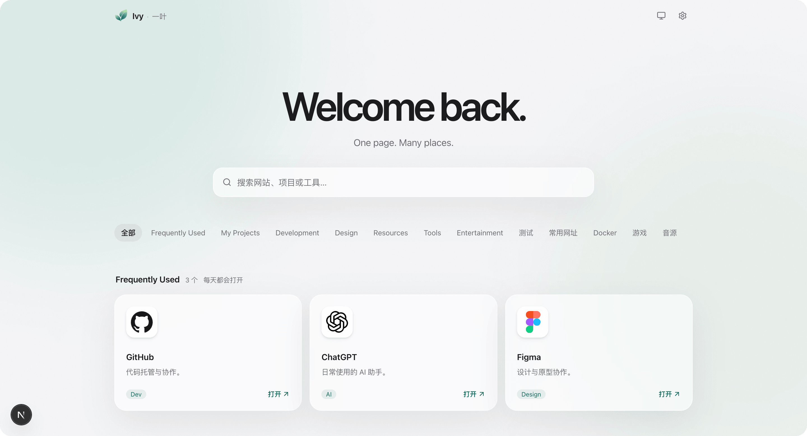
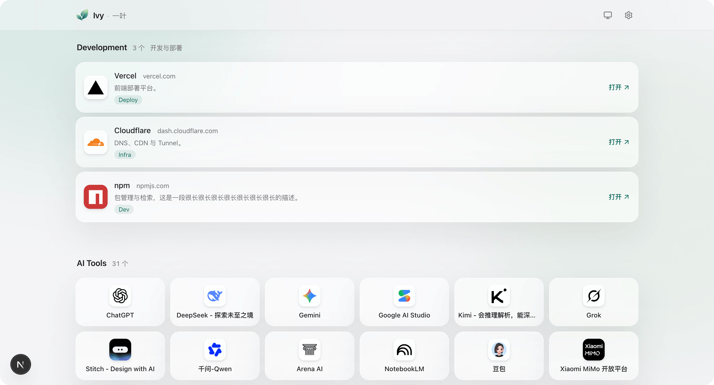

# Ivy · 一叶

> One page. Many places.


[](https://github.com/VenenoSix24/ivy-nav/actions/workflows/ci.yml)
[](https://nextjs.org)
[](https://react.dev)
[](https://www.typescriptlang.org)
[](https://tailwindcss.com)
[](https://orm.drizzle.team)
[](./LICENSE)

个人专属的网站、项目与常用工具导航。
自托管，支持导入书签，所有内容都可以直接在页面中管理，无需修改代码。

## 特性

- 🗂️ **分类管理** — 按分类组织网站、项目与工具
- ✏️ **前台编辑** — 直接在首页编辑、排序和管理内容
- 🔍 **即时搜索** — 搜索标题、描述、网址、域名、标签与分类
- 🎨 **多种布局** — 每个分类可独立选择卡片、列表或紧凑布局
- 🌓 **主题切换** — Light / Dark / System
- 🎯 **多种图标来源** — 自动获取、图标库、Emoji、自定义上传
- 🔒 **Public / Private** — 支持公开与私有内容
- 📥 **书签导入** — 支持 Chrome、Edge、Firefox、Safari
- 💾 **备份与恢复** — JSON 数据导入导出与数据库快照
- 📱 **响应式设计** — 适配桌面、平板与移动设备

## 界面



每个分类都可以选择自己的展示方式：

- **卡片** — 适合项目、常用网站等信息较完整的内容
- **列表** — 适合普通网站与工具
- **紧凑** — 适合大量常用入口



同一个页面里，**列表**与**紧凑**可以并存。

## 图标

支持多种图标来源：

| 来源   | 说明                            |
| ------ | ------------------------------- |
| 自动   | 根据网站信息自动获取图标        |
| 图标库 | Simple Icons、Iconify、自定义库 |
| Emoji  | 内置常用 Emoji 搜索             |
| 上传   | PNG / JPG / WEBP / SVG          |
| 无     | 使用标题首字母                  |

图标库中的图标会在选择后保存到本地，不依赖第三方服务长期加载。

也支持添加自定义图标集。

## 快速开始

需要 Node.js 22+ 与 pnpm。

```bash
pnpm install
pnpm dev
```

然后打开：

```text
http://localhost:3000
```

首次使用时创建管理员账号：

```bash
pnpm admin:create ivy
```

也可以通过环境变量指定密码：

```bash
ADMIN_PASSWORD=... pnpm admin:create ivy
```

忘记密码时：

```bash
pnpm admin:create --reset
```

如果只想快速查看页面，可以导入演示数据：

```bash
pnpm db:seed
```

## 常用命令

```bash
pnpm dev            # 开发服务器
pnpm build          # 生产构建
pnpm start          # 运行生产构建
pnpm test           # 单元测试
pnpm lint           # ESLint
pnpm typecheck      # TypeScript 类型检查
pnpm format         # 格式化
pnpm format:check   # 检查格式
pnpm db:generate    # 生成数据库迁移
pnpm db:seed        # 导入演示数据
pnpm brand:assets   # 生成品牌资源
pnpm e2e            # 接口回归测试
```

## 数据与权限

Ivy · 一叶使用 SQLite 保存数据，不需要额外的数据库服务。

内容支持两种可见性：

- `Public` — 所有人可见，未登陆时的页面。
- `Private` — 仅管理员可见，登陆后显示。

Private 内容由服务端过滤，未登录用户不会收到对应数据。

管理员通过 Session + HttpOnly Cookie 登录，所有管理操作都需要有效的管理员会话。

## 书签导入

支持导入浏览器导出的 `bookmarks.html`：

- Chrome
- Edge
- Firefox
- Safari

导入前会先进行预览，可以查看分类、标签、重复网址等信息，确认后再写入数据库。

现有内容不会被删除。

## 备份

支持两种方式：

- **JSON 导出 / 导入** — 适合迁移内容
- **数据库快照** — 完整备份 SQLite 数据库

管理员账号和登录状态不会包含在 JSON 导出中。

> 数据库备份包含管理员密码哈希，请妥善保存。

## 技术栈

| 层     | 技术                      |
| ------ | ------------------------- |
| 框架   | Next.js · App Router      |
| 前端   | React · TypeScript        |
| UI     | Tailwind CSS · shadcn/ui  |
| 数据库 | SQLite · Drizzle ORM      |
| 认证   | Session · HttpOnly Cookie |
| 主题   | next-themes               |
| 动画   | CSS · Motion              |
| 拖拽   | dnd-kit                   |

## 部署

推荐部署在自有服务器上：Next.js + Node.js + SQLite，不需要额外的数据库服务。

### 完整项目（推荐）

服务器上保留完整项目，建号、迁移与备份都能直接在服务器上做。

```bash
git clone <仓库地址> /srv/ivy-nav
cd /srv/ivy-nav
pnpm install --frozen-lockfile
pnpm build

# 首次部署时建管理员（数据库不存在会自动建表）
DATABASE_PATH=/srv/ivy-nav/data/portal.db ADMIN_PASSWORD=... pnpm admin:create ivy

# 启动
DATABASE_PATH=/srv/ivy-nav/data/portal.db PORT=3000 HOSTNAME=127.0.0.1 pnpm start
```

### 运行与反代

- 数据库、上传的图标与备份都在应用目录下的 `data/`、`uploads/`、`backups/`，记得一并持久化并定期快照。
- 用 HTTPS，`SESSION_COOKIE_SECURE` 保持默认的 `true`；只有反代可信时才设 `TRUST_PROXY_HEADERS=true`。
- 部署到公网时设 `NEXT_PUBLIC_SITE_URL`，分享卡片的链接才是对的。
- 常驻可以使用 systemd：`ExecStart` 用 `pnpm start`，配上 `Restart=on-failure`。
- 其余环境变量见 `.env.example`。

### Vercel 等托管平台

Vercel 这类托管平台需自行解决 SQLite 兼容的托管服务，或者保持自有服务器部署。

## 项目结构

```text
scripts/
├── brand/
└── e2e/

src/
├── app/
├── components/
│   ├── ui/
│   ├── portal/
│   ├── editor/
│   ├── icons/
│   ├── settings/
│   └── auth/
├── db/
├── hooks/
└── lib/
    ├── api/
    ├── auth/
    ├── backup/
    ├── bookmarks/
    ├── icons/
    ├── net/
    ├── portal/
    ├── settings/
    └── utils/
```

各模块做什么、有哪些坑，见 [docs/](docs/)。

## Roadmap

目前暂不计划加入与导航核心无关的功能。

后续可能加入：

- 自动备份
- 网站状态检查
- 最近访问
- 访问统计
- PWA

## License

MIT License，详见 [LICENSE](./LICENSE)。
